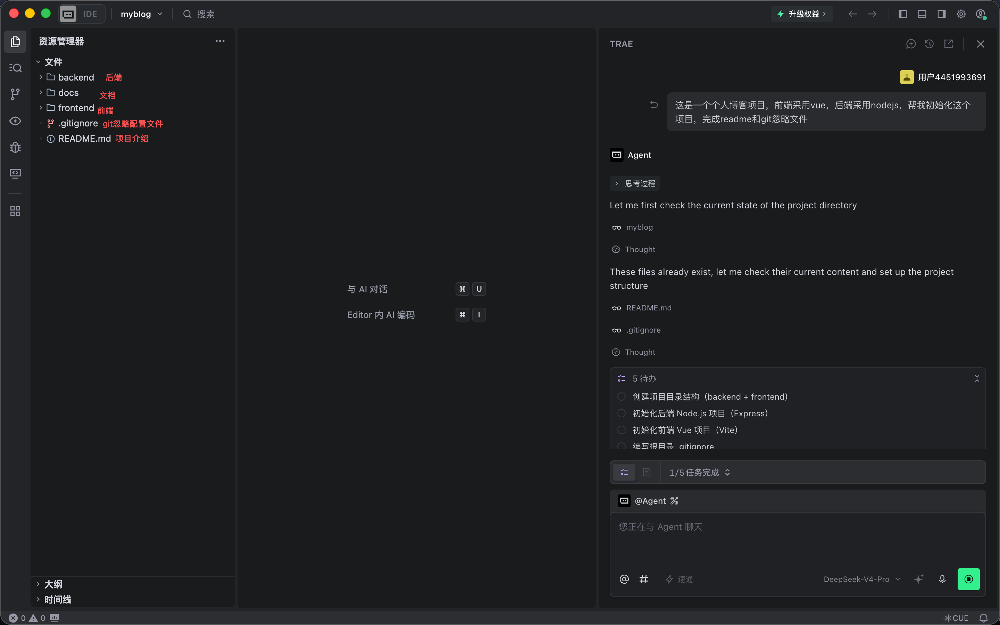
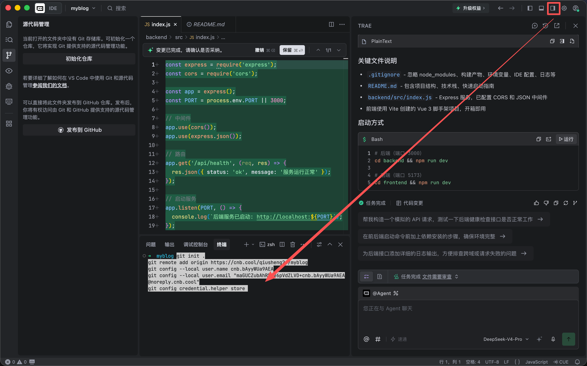
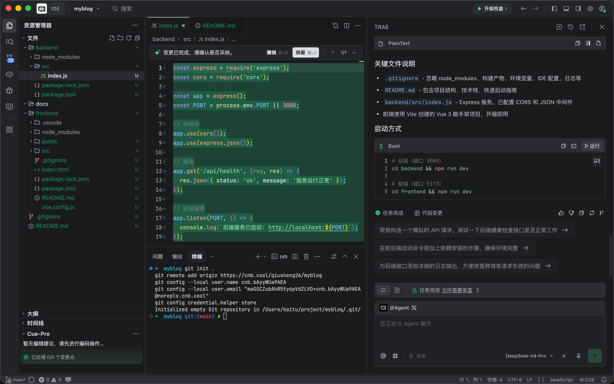
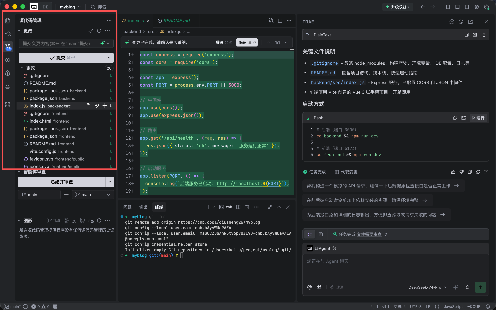
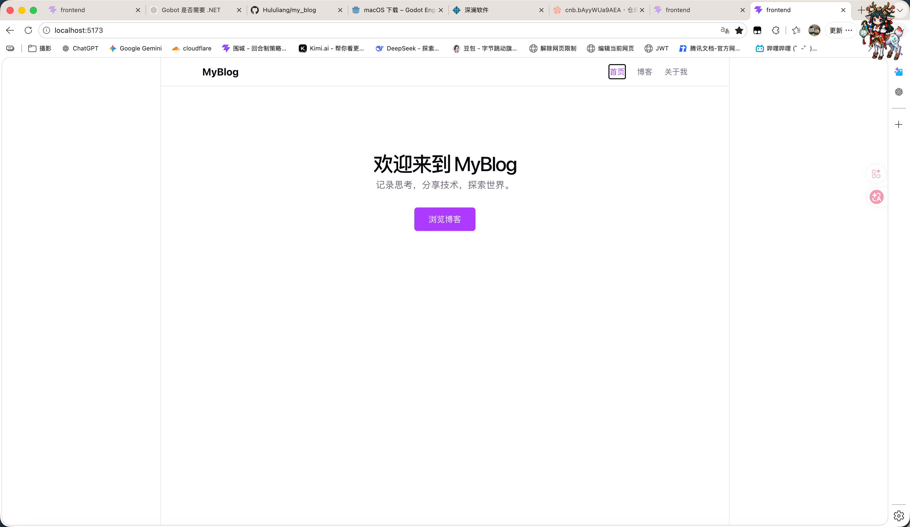
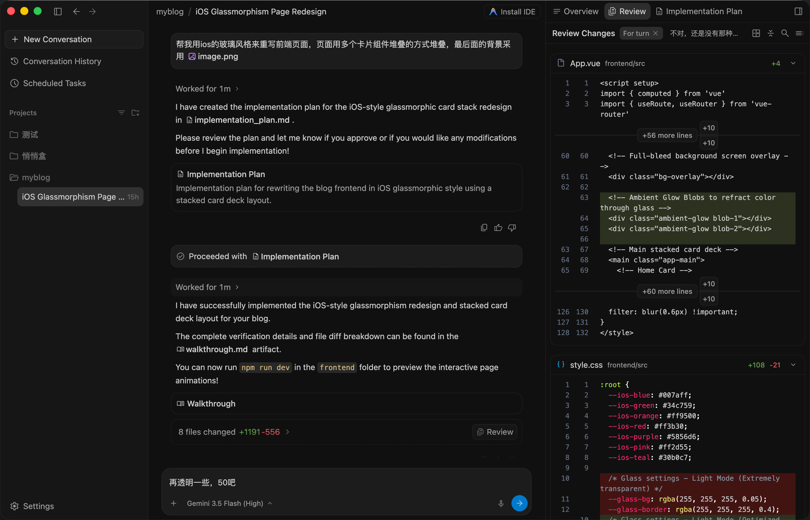
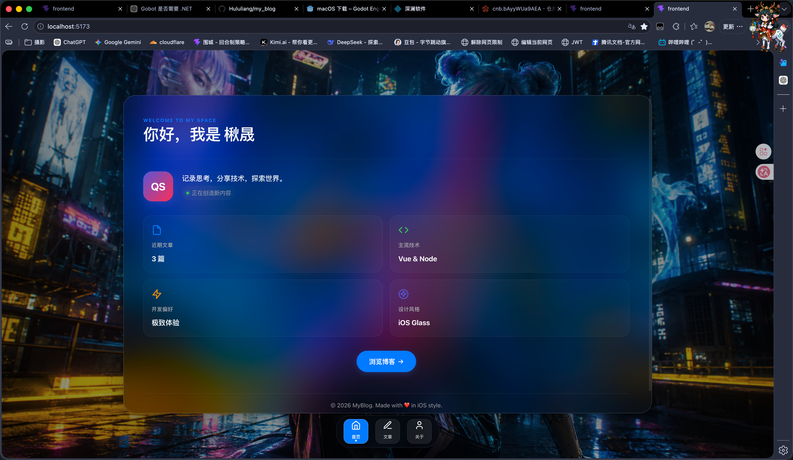

# 个人博客项目 0-1 阶段课程整理

来源材料：

- `个人博客项目教学路线文档_增强版.docx`
- `1.png` 到 `14.png`
- `聊天记录.md`

说明：`聊天记录.md` 原始内容为空，本整理根据路线文档和截图复原阶段脉络，适合作为课程讲义、复盘记录或后续继续补充的基础版本。

## 一、课程定位

项目名称：个人博客管理系统。

课程目标不是让初学者一次性掌握 Vue、Node.js、MySQL、部署和 AI，而是通过一个完整项目，让他体验真实项目从需求、项目结构、Git、前后端、页面、接口、数据库到部署维护的基本流程。

阶段 0 和阶段 1 的核心任务是把项目“立起来”和“看得见”：

| 阶段 | 目标 | 关键词 |
| --- | --- | --- |
| 阶段 0 | 搭建项目骨架，建立 Git 和远程仓库意识 | frontend、backend、docs、README、.gitignore、Git |
| 阶段 1 | 先不接数据库和后端，做出可访问的静态页面 | Vue、Vue Router、静态数据、导航、页面预览 |

## 二、阶段 0：初始化项目和 Git

### 1. 阶段目标

让学员知道一个正式项目不是从单个文件开始，而是从清晰的目录结构、说明文档、版本管理和可启动的前后端骨架开始。

### 2. 推荐开场提示词

```text
这是一个个人博客项目，前端采用 Vue，后端采用 Node.js。
请帮我初始化这个项目，完成 README 和 Git 忽略文件。
要求包含 frontend、backend、docs 三个目录，并分别说明它们的职责。
```

截图证据：[1.png](../1.png)



### 3. 本阶段产出

| 产出 | 作用 |
| --- | --- |
| `frontend/` | Vue 前端项目，用来承载页面、路由、组件和样式 |
| `backend/` | Node.js / Express 后端项目，用来承载 API 和业务逻辑 |
| `docs/` | 项目文档、接口文档、部署说明和阶段复盘 |
| `README.md` | 项目说明书，写清项目结构、技术栈和启动方式 |
| `.gitignore` | 避免提交 `node_modules`、环境变量、构建产物和 IDE 配置 |
| Git 仓库 | 记录每个阶段的改动，形成可追踪的开发历史 |

### 4. 推荐任务拆解

1. 创建项目根目录。
2. 创建 `frontend`、`backend`、`docs`。
3. 初始化前端 Vue 3 + Vite 项目。
4. 初始化后端 Node.js + Express 项目。
5. 后端提供 `/api/health` 健康检查接口。
6. 编写根目录 `README.md`。
7. 编写根目录 `.gitignore`。
8. 初始化 Git，并关联远程仓库。
9. 提交第一个 commit。

### 5. Git 和远程仓库整理

截图中出现了 CNB 远程仓库创建和迁移指引：

- [3.png](../3.png)：进入“我的仓库”。
- [4.png](../4.png)：仓库列表与“新建仓库”入口。
- [5.png](../5.png)：创建 `myblog` 仓库。
- [6.png](../6.png)：平台给出的 Git 迁移、分支迁移和空仓初始化命令。
- [10.png](../10.png)：远程仓库已创建。

建议课堂中只保留最小必要命令，避免一开始讲太多 Git 细节：

```bash
git init .
git remote add origin <remote-url>
git add .
git commit -m "初始化项目和 Git"
git push -u origin main
```

如果远程平台默认分支不是 `main`，先确认本地分支名再推送：

```bash
git branch
git remote -v
git status
```

### 6. 阶段 0 验收标准

- 能说清楚 `frontend`、`backend`、`docs` 分别负责什么。
- 本地能启动前端项目。
- 本地能启动后端项目。
- 后端 `/api/health` 能返回正常状态。
- `.gitignore` 已排除 `node_modules` 和环境变量文件。
- `README.md` 包含项目结构、技术栈和启动方式。
- 本地 Git 已初始化，能看到文件变更。
- 已关联远程仓库，并完成第一次提交或推送。

截图证据：







### 7. 阶段 0 讲师提示

- 不要一开始追求功能完整，先让项目能启动、能提交、能说明。
- `node_modules` 不要提交，`.env` 不要提交。
- 让学员每次提交前看一次 `git status`，建立“提交前检查”的习惯。
- AI 生成代码后，必须让它解释关键文件：`README.md`、`.gitignore`、`backend/src/index.js`、`frontend/package.json`。
- 阶段 0 的重点不是 Vue 或 Express 细节，而是“项目工程化起步”。

## 三、阶段 1：静态页面和路由

### 1. 阶段目标

先不接数据库，也不依赖后端接口，先用静态数据做出能访问、能跳转、能展示博客内容的网站雏形。

### 2. 推荐开场提示词

```text
现在进入阶段 1：静态页面和路由。
请在 Vue 前端中完成首页、博客列表、博客详情和关于我页面。
先使用静态博客数据，不要连接后端和数据库。
要求有导航栏、基础样式、路由跳转，并能通过 npm run dev 预览。
```

### 3. 推荐页面范围

| 路由 | 页面 | 学习点 |
| --- | --- | --- |
| `/` | 首页 | 项目入口、导航、主视觉 |
| `/posts` | 博客列表 | 列表渲染、静态数据 |
| `/posts/:id` | 博客详情 | 动态路由、参数读取 |
| `/about` | 关于我 | 普通静态页面 |
| 兜底路由 | 404 页面 | 未匹配路由处理 |

### 4. 本阶段要讲清楚的概念

- Vue 组件：页面可以拆成多个可复用模块。
- Vue Router：URL 和页面组件的映射关系。
- 列表渲染：用数组生成博客卡片。
- 动态路由：通过 `id` 找到对应文章。
- 静态数据：阶段 1 先把数据写在前端，后面再换成 API。
- 本地预览：通过 `npm run dev` 打开 `localhost:5173`。

截图证据：[12.png](../12.png)



### 5. 视觉迭代记录

阶段 1 后半段出现了一次前端视觉重写，目标是把页面改成 iOS 玻璃拟态风格，并使用背景图作为视觉基础。

截图中的提示词可整理为：

```text
帮我用 iOS 的玻璃风格来重写前端页面。
页面用多个卡片组件堆叠的方式呈现。
最后面的背景采用 image.png。
```

截图证据：

- [13.png](../13.png)：AI 生成实现计划和改动审查。
- [14.png](../14.png)：视觉改版后的页面效果。





### 6. 阶段 1 验收标准

- `npm run dev` 后能打开前端页面。
- 首页、博客列表、博客详情、关于我页面可以互相跳转。
- 博客列表由静态数组渲染。
- 博客详情能通过路由参数展示不同文章。
- 刷新页面不应出现明显空白或报错。
- 导航栏能体现当前页面。
- 样式能区分页面结构，而不是所有内容堆在一起。
- 如果做视觉改版，改版后仍要保留路由跳转能力。

### 7. 推荐提交

```bash
git checkout -b feature/static-pages
git add .
git commit -m "静态页面和路由"
```

如果阶段 1 里又做了视觉改版，建议拆成第二个提交：

```bash
git add .
git commit -m "优化首页视觉风格"
```

### 8. 阶段 1 讲师提示

- 静态页面阶段不要急着引入后端、数据库和登录。
- 要让学员先理解“页面怎么由路由切换”，再理解“数据怎么从接口来”。
- AI 改页面时，要求它说明改了哪些文件，不要直接让学员盲目接受大批改动。
- 视觉改版可以作为兴趣点，但验收优先级仍然是路由、页面和可运行。

## 四、0 到 1 的课程串联方式

阶段 0 解决“项目从哪里开始”：

```text
需求 -> 项目结构 -> README -> .gitignore -> 本地启动 -> Git -> 远程仓库
```

阶段 1 解决“用户能看到什么”：

```text
Vue 项目 -> 路由 -> 首页 -> 列表 -> 详情 -> 关于我 -> 页面预览 -> 视觉优化
```

这两个阶段讲完后，学员应该能回答：

- 前端、后端、文档目录为什么要分开？
- 为什么要写 README？
- 为什么不能提交 `node_modules`？
- Git 的第一次提交记录了什么？
- Vue Router 解决了什么问题？
- 为什么阶段 1 可以先用静态数据？
- AI 生成代码后，自己需要验证哪些东西？

## 五、下一阶段建议

阶段 2 可以进入“组件化和基础样式”，把阶段 1 中的页面拆成更清晰的组件：

- `Header`
- `Footer`
- `BlogCard`
- `Layout`
- 空状态页面
- 404 页面
- 响应式布局

进入阶段 2 前，建议先让学员完成一份简短复盘：

```text
这一阶段我做了什么？
我新增或修改了哪些文件？
我运行了哪些命令？
我遇到了什么问题？
我是怎么验证页面能工作的？
```
