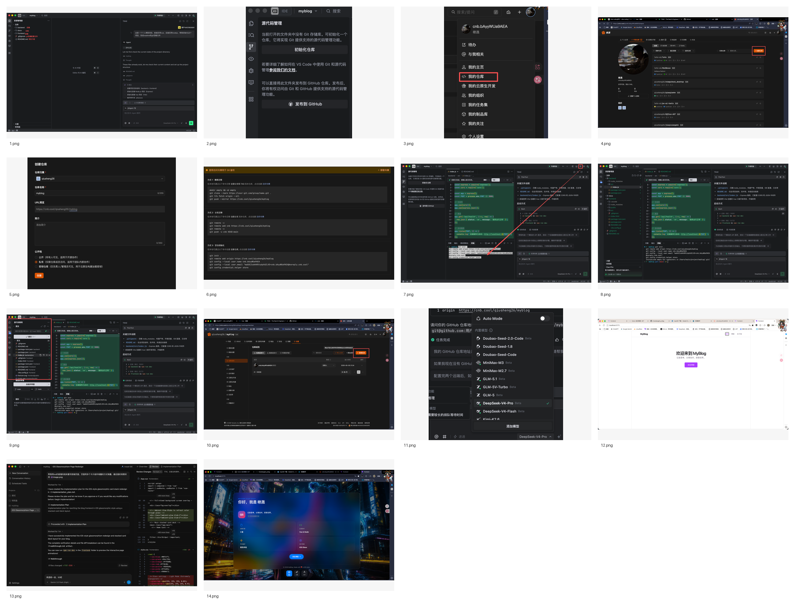

# 截图索引

| 截图 | 阶段 | 画面内容 | 建议用途 |
| --- | --- | --- | --- |
| [1.png](../1.png) | 阶段 0 | Trae 中输入初始化项目提示词，左侧已有 `backend`、`frontend`、`docs`、`.gitignore`、`README.md` | 放在“项目初始化任务”小节 |
| [2.png](../2.png) | 阶段 0 | VS Code 源代码管理提示当前目录未初始化 Git | 放在“为什么需要 Git 初始化”小节 |
| [3.png](../3.png) | 阶段 0 | CNB 个人菜单中进入“我的仓库” | 放在“创建远程仓库流程”小节 |
| [4.png](../4.png) | 阶段 0 | CNB 仓库列表与“新建仓库”入口 | 放在“创建远程仓库流程”小节 |
| [5.png](../5.png) | 阶段 0 | 创建 `myblog` 仓库表单 | 放在“远程仓库命名和可见性”小节 |
| [6.png](../6.png) | 阶段 0 | CNB 提供的裸库迁移、分支迁移、空仓初始化命令 | 放在“Git 远程关联命令”小节 |
| [7.png](../7.png) | 阶段 0 | 后端 `index.js`、README 启动说明、Git 初始化命令 | 放在“本地项目初始化结果”小节 |
| [8.png](../8.png) | 阶段 0 | 展开后的项目结构，包含前后端依赖和文件 | 放在“阶段 0 产出物”小节 |
| [9.png](../9.png) | 阶段 0 | Git 源代码管理面板，显示待提交文件 | 放在“第一次提交前检查”小节 |
| [10.png](../10.png) | 阶段 0 | CNB 中 `myblog` 仓库已创建 | 放在“远程仓库验收”小节 |
| [11.png](../11.png) | 辅助素材 | AI 模型选择界面 | 放在“AI 工具使用环境”或附录 |
| [12.png](../12.png) | 阶段 1 | 浏览器访问 `localhost:5173`，展示 MyBlog 首页、导航和按钮 | 放在“静态页面验收”小节 |
| [13.png](../13.png) | 阶段 1 | Gemini/Codex 类工具中请求 iOS 玻璃风格改版并审查变更 | 放在“视觉迭代记录”小节 |
| [14.png](../14.png) | 阶段 1 | iOS 玻璃拟态风格页面最终效果 | 放在“视觉优化结果”小节 |

## 使用建议

- 讲阶段 0 时，优先使用 `1.png`、`6.png`、`8.png`、`9.png`、`10.png`。
- 讲阶段 1 时，优先使用 `12.png`、`13.png`、`14.png`。
- `2.png` 到 `5.png` 更适合做 Git 和远程仓库操作补充，不必全部放进主讲义。
- `11.png` 是工具环境截图，不属于项目功能本身，可作为附录。
