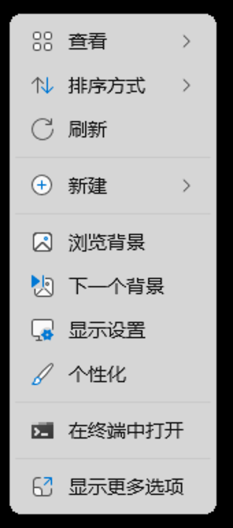
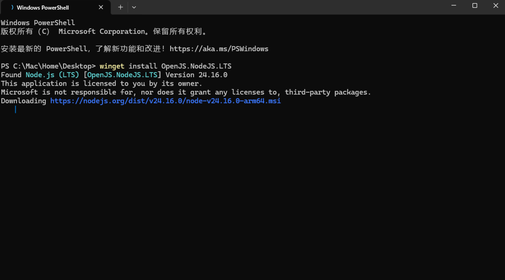
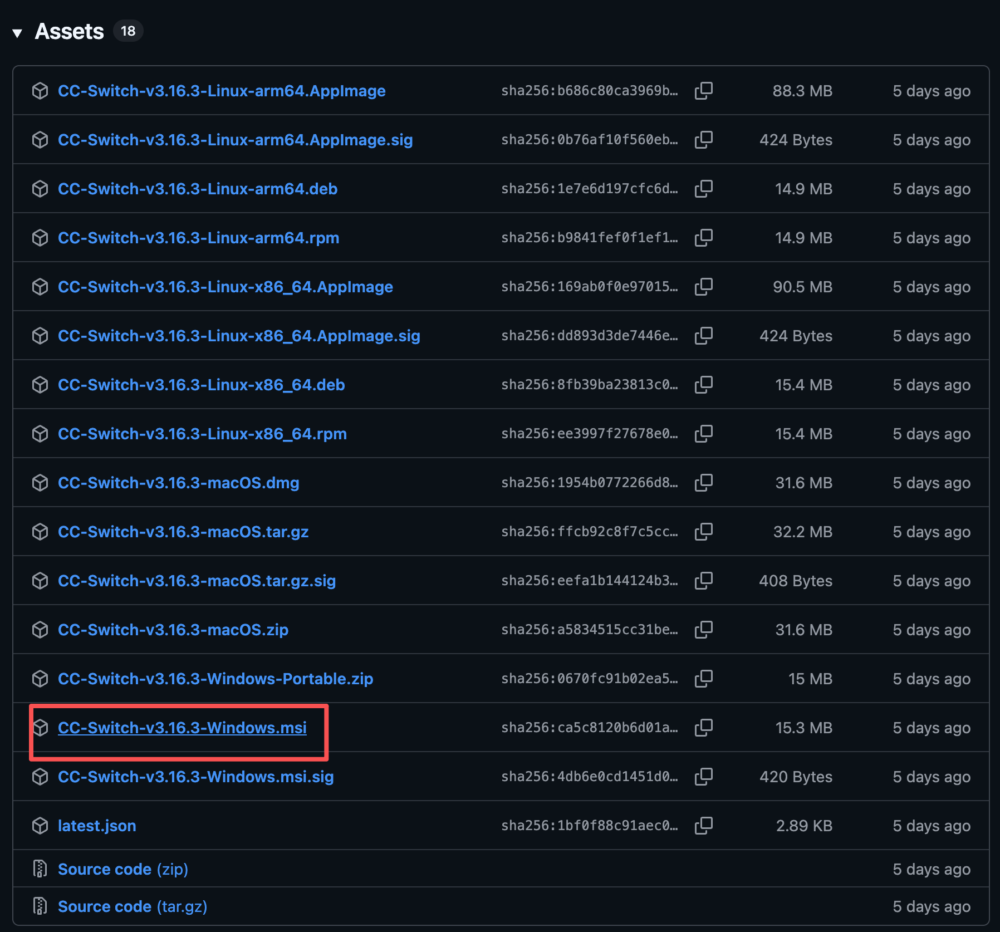
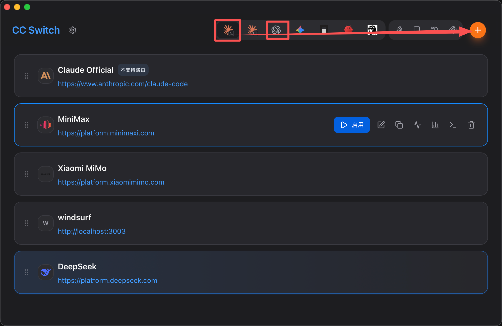
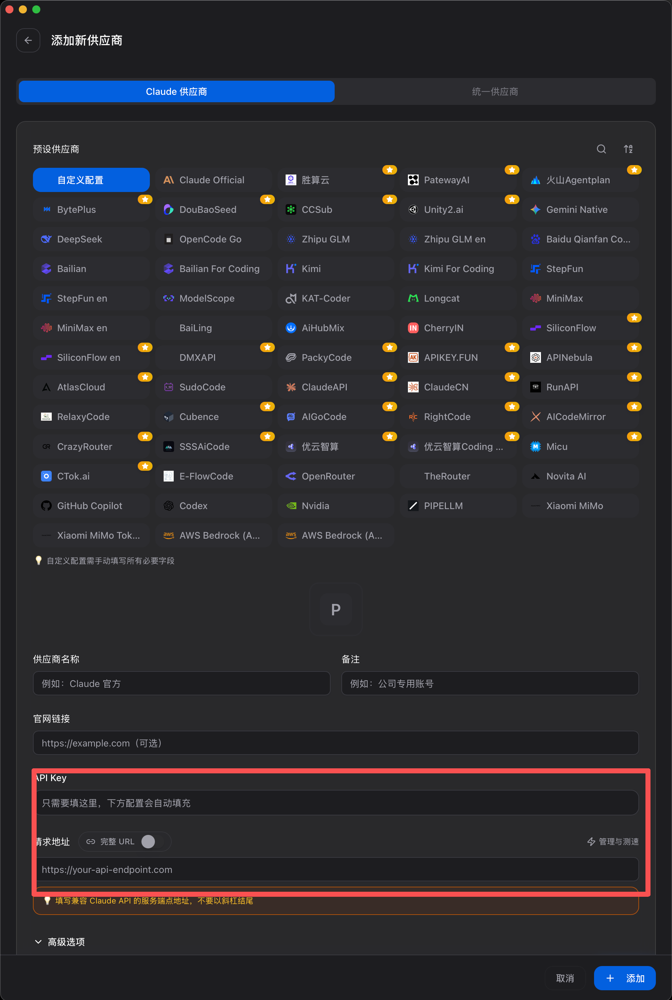
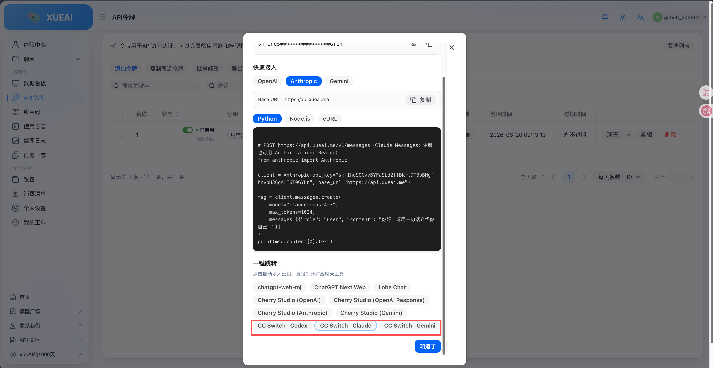
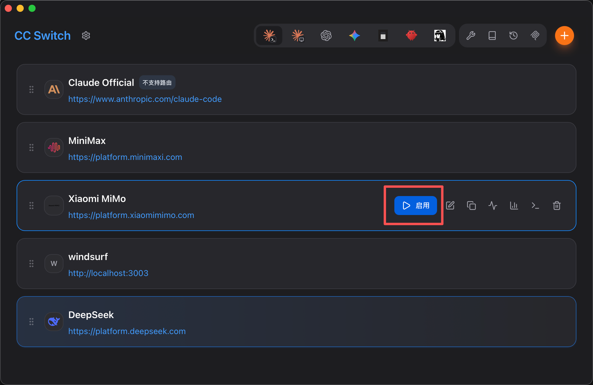

前置
安装nodejs
打开终端

winget install OpenJS.NodeJS.LTS
没有winget？https://learn.microsoft.com/zh-cn/windows/package-manager/winget/

可能遇到的问题 在此系统上禁止运行脚本（链接到常见问题）
node --version
npm --version
验证安装
如果提示没有找到先重启终端再进行尝试（可以按上按键到上个命令）
如果还是不行建议重新安装（uninstall卸载）
# 1. 配置阿里云源为默认源（核心命令）
npm config set registry https://registry.npmmirror.com
# 2. 验证配置是否生效（查看当前源）
npm config get registry
# 预期输出：https://registry.npmmirror.com
npm install -g @openai/codex
npm install -g @anthropic-ai/claude-code
全局安裝codex或cc
接下来安装ccswitch
https://github.com/farion1231/cc-switch/releases

如果网页打不开也可以加QQ群获取安装包
打开ccswitch

选择Claude code或codex点击右上角加号添加渠道

填写中转站的请求地址以及APIkey
当然有些中转站也可以一键导入

然后点击启用就可以使用啦